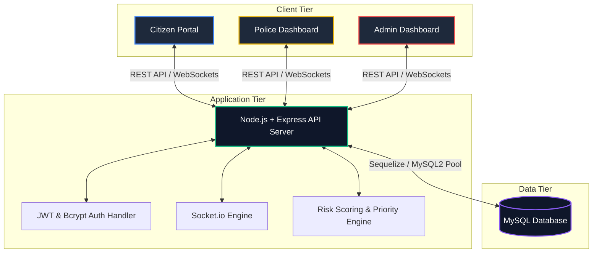

# 🚔 Criminal Intelligence & Public Safety Management System (CIPMS)

An enterprise-grade, data-driven platform designed to modernize public safety, streamline police operations, and enhance citizen-police collaboration. Moving beyond traditional CRUD-based FIR filing systems, CIPMS integrates real-time analytics, geospatial crime intelligence, officer performance tracking, and automated risk assessment to deliver a robust public safety ecosystem.

---

## 🌟 Key Features
- **Comprehensive Criminal Tracking**: Active databases detailing criminal profiles, offense history, and dynamically calculated threat levels.
- **FIR Lifecycle Management**: Transparency at every stage—from citizen filing to officer investigation and final case closure.
- **Officer Dispatch & Workflow Optimization**: Automated and manual duty assignment, workload distribution, and performance tracking.
- **Geospatial Hotspot Analysis**: Interactive mapping of crime clusters to assist in predictive patrolling.
- **Emergency SOS Dashboard**: Real-time location tracking for emergency responders when a citizen triggers a distress request.
- **Citizen Engagement Portal**: Safe, remote portal for citizens to register complaints, monitor case updates, and pay traffic challans.

---

## 🛠️ Recommended Tech Stack

CIPMS employs a decoupling of concerns using a modern, multi-tier architecture:

```
┌─────────────────────────────────────────────────────────────────┐
│                           FRONTEND                              │
│              React.js | TypeScript | Tailwind CSS               │
│               Shadcn UI | Leaflet.js (Map rendering)            │
└───────────────────────────────┬─────────────────────────────────┘
                                │
                                │ HTTPS Requests / WebSockets
                                ▼
┌─────────────────────────────────────────────────────────────────┐
│                          REST API / WS                          │
│             Node.js + Express.js | Socket.io (Real-time)        │
└───────────────────────────────┬─────────────────────────────────┘
                                │
                                │ SQL Queries (ORM/Pool)
                                ▼
┌─────────────────────────────────────────────────────────────────┐
│                          DATABASE LAYER                         │
│                    MySQL (Relational Engine)                    │
└─────────────────────────────────────────────────────────────────┘
```

- **Frontend**: **React** (v18+) with **TypeScript** for robust typing, **Tailwind CSS** & **Shadcn UI** for a clean, modern aesthetic, and **Leaflet.js** for mapping crime data.
- **Backend**: **Node.js** with **Express.js** running a RESTful API service. **Socket.io** is used to manage real-time communications (SOS tracking, instant case notifications).
- **Database**: **MySQL** for relational integrity, constraints, transactional safety (ACID compliance), and high-performance querying.

---

## 🏗️ System Architecture

CIPMS facilitates specific portal interfaces mapped to dedicated user workflows, connected to a single API server backed by a transactional relational database.



---

## 👥 User Roles & Access Control

Role-Based Access Control (RBAC) secures endpoint authorization:

| Role | Access Level | Core Responsibilities | Key Views / Actions |
| :--- | :--- | :--- | :--- |
| **Citizen** | Low | Register complaints, seek assistance, pay dues | File FIRs, track FIR lifecycle, trigger SOS, pay Challans |
| **Police Officer** | Medium | Execute investigations, update case records | Process FIRs, log investigation journals, update suspect files |
| **Inspector** | High | Police station supervision, duty logs, performance auditing | Assign cases, duty rosters, station report extraction |
| **Admin** | Superuser | System configurations, user roles, security settings | Station CRUD, user access modification, master crime analytics |

---

## 🗄️ Database Schema & Architecture

### Entity-Relationship Diagram (ERD)

```mermaid
erDiagram
    USERS ||--o{ FIRS : "files"
    USERS ||--o{ EMERGENCY_REQUESTS : "triggers"
    USERS ||--o| OFFICERS : "is_assigned_to"
    USERS ||--o{ CHALLANS : "receives"
    
    OFFICERS ||--o{ CASES : "investigates"
    FIRS ||--o| CASES : "initiates"
    CRIMINALS ||--o{ CASES : "implicated_in"

    USERS {
        int id PK
        varchar name
        varchar email UNIQUE
        varchar phone
        varchar password_hash
        enum role
        timestamp created_at
    }

    OFFICERS {
        int id PK
        int user_id FK
        varchar badge_number UNIQUE
        varchar station
        varchar rank
    }

    FIRS {
        int id PK
        int user_id FK
        varchar title
        varchar description
        varchar location
        enum status
        timestamp created_at
    }

    CRIMINALS {
        int id PK
        varchar name
        int age
        text address
        int crime_count
        enum wanted_status
        varchar photo_url
    }

    CASES {
        int id PK
        int fir_id FK,UNIQUE
        int criminal_id FK "nullable"
        int officer_id FK "nullable"
        enum status
        text remarks
    }

    CHALLANS {
        int id PK
        int user_id FK "nullable"
        varchar vehicle_no
        decimal amount
        enum status
        timestamp issue_date
    }

    EMERGENCY_REQUESTS {
        int id PK
        int user_id FK "nullable"
        decimal latitude
        decimal longitude
        varchar request_type
        enum status
        timestamp created_at
    }
```

### SQL Schema DDL (Phase 1 Baseline)

Execute the script below in your MySQL database to instantiate the relational tables, constraints, and relationships:

```sql
CREATE DATABASE IF NOT EXISTS cipms_db;
USE cipms_db;

-- 1. Users Table (Base Account Structure)
CREATE TABLE users (
    id INT AUTO_INCREMENT PRIMARY KEY,
    name VARCHAR(255) NOT NULL,
    email VARCHAR(255) UNIQUE NOT NULL,
    phone VARCHAR(20) NOT NULL,
    password_hash VARCHAR(255) NOT NULL,
    role ENUM('citizen', 'police', 'inspector', 'admin') DEFAULT 'citizen',
    created_at TIMESTAMP DEFAULT CURRENT_TIMESTAMP
);

-- 2. Officers Table (Links to Users)
CREATE TABLE officers (
    id INT AUTO_INCREMENT PRIMARY KEY,
    user_id INT NOT NULL,
    badge_number VARCHAR(50) UNIQUE NOT NULL,
    station VARCHAR(100) NOT NULL,
    `rank` VARCHAR(50) NOT NULL,
    FOREIGN KEY (user_id) REFERENCES users(id) ON DELETE CASCADE
);

-- 3. FIRs Table
CREATE TABLE firs (
    id INT AUTO_INCREMENT PRIMARY KEY,
    user_id INT NOT NULL,
    title VARCHAR(255) NOT NULL,
    description TEXT NOT NULL,
    location VARCHAR(255) NOT NULL,
    status ENUM('Pending', 'Approved', 'Investigating', 'Closed', 'Rejected') DEFAULT 'Pending',
    created_at TIMESTAMP DEFAULT CURRENT_TIMESTAMP,
    FOREIGN KEY (user_id) REFERENCES users(id) ON DELETE CASCADE
);

-- 4. Criminals Table
CREATE TABLE criminals (
    id INT AUTO_INCREMENT PRIMARY KEY,
    name VARCHAR(255) NOT NULL,
    age INT NOT NULL,
    address TEXT,
    crime_count INT DEFAULT 0,
    wanted_status ENUM('Low Risk', 'Medium Risk', 'High Risk', 'Wanted') DEFAULT 'Low Risk',
    photo_url VARCHAR(500),
    created_at TIMESTAMP DEFAULT CURRENT_TIMESTAMP
);

-- 5. Cases Table (Intersection of FIR, Officer, and Criminals)
CREATE TABLE cases (
    id INT AUTO_INCREMENT PRIMARY KEY,
    fir_id INT UNIQUE NOT NULL,
    criminal_id INT DEFAULT NULL,
    officer_id INT DEFAULT NULL,
    status ENUM('Active', 'Under Investigation', 'Solved', 'Cold Case') DEFAULT 'Active',
    remarks TEXT,
    FOREIGN KEY (fir_id) REFERENCES firs(id) ON DELETE CASCADE,
    FOREIGN KEY (criminal_id) REFERENCES criminals(id) ON DELETE SET NULL,
    FOREIGN KEY (officer_id) REFERENCES officers(id) ON DELETE SET NULL
);

-- 6. Challans Table (Traffic violations and tracking)
CREATE TABLE challans (
    id INT AUTO_INCREMENT PRIMARY KEY,
    user_id INT DEFAULT NULL,
    vehicle_no VARCHAR(20) NOT NULL,
    amount DECIMAL(10, 2) NOT NULL,
    status ENUM('Unpaid', 'Paid') DEFAULT 'Unpaid',
    issue_date TIMESTAMP DEFAULT CURRENT_TIMESTAMP,
    FOREIGN KEY (user_id) REFERENCES users(id) ON DELETE SET NULL
);

-- 7. Emergency Requests (Distress beacons)
CREATE TABLE emergency_requests (
    id INT AUTO_INCREMENT PRIMARY KEY,
    user_id INT DEFAULT NULL,
    latitude DECIMAL(10, 8) NOT NULL,
    longitude DECIMAL(11, 8) NOT NULL,
    request_type VARCHAR(100) NOT NULL, -- e.g., 'Medical', 'Assault', 'Theft'
    status ENUM('Active', 'Dispatched', 'Resolved') DEFAULT 'Active',
    created_at TIMESTAMP DEFAULT CURRENT_TIMESTAMP,
    FOREIGN KEY (user_id) REFERENCES users(id) ON DELETE SET NULL
);
```

---

## 🧠 Advanced Features (Project Differentiators)

### 📍 Crime Hotspot Analysis
Using **Leaflet.js** and **OpenStreetMap**, geographic coordinates parsed from filed FIRs are visualised on an interactive map using marker clusters. 
- Officers can filter maps by **time windows** or **crime type**.
- Identifies critical zones to optimize police patrols.
- Allows public users to avoid designated high-risk zones.

### 🔢 Criminal Risk Scoring Algorithm
Moving beyond basic counters, criminals are assigned a dynamic risk score computed at the application level whenever their profile updates:

$$\text{Risk Score} = (\text{Crimes Count} \times 10) + (\text{Violent Crimes} \times 20) + (\text{Active Warrants} \times 30)$$

Classification mapping:
- **0–20**: `Low Risk`
- **21–50**: `Medium Risk`
- **51–99**: `High Risk`
- **100+** or Any Active Warrant: `Wanted` / `High Priority Threat`

### 📊 Officer Performance Dashboard
Helps Inspectors and Administrators manage resource efficiency by tracking:
- **Total Cases Assigned** vs. **Resolved**.
- **Average Resolution Time** (days elapsed from Case creation to 'Solved' status).
- **Active Duty Status** (Online/On-call/On-scene).

### 🏷️ Intelligent FIR Priority & Category Router
Before manual review, incoming FIR descriptions are scanned using keyword processing to suggest categories and alert priorities instantly:
- **Missing Person**: High Priority.
- **Assault / Active Violence**: Urgent/SOS Priority.
- **Theft / Cyber Fraud**: Medium Priority.

### 🔔 Real-Time Operations via Socket.io
- **SOS Broadcast**: Broadcasts active coordinates immediately to nearest available officer dashboard when a citizen presses the SOS button.
- **Incident Dispatch**: Instant alerts push to officers' dashboards on case assignments.

---

## 📈 Dashboard Metrics Overview

### Admin & Inspector Dashboard Metrics
- **Performance KPIs**:
  - *Active Incident Ratio*: Resolved cases / Active cases.
  - *Mean Time to Resolution (MTTR)*.
  - *Daily Crime Trend Line Chart* (built with Recharts or Chart.js).
- **Core Counters**:
  - Total Outstanding FIRs.
  - Active Cases Under Investigation.
  - Warrants Issued (Wanted Criminals).
  - Stations with High Workloads.

---

## 🔒 Security Architectures

- **Authentication**: Stateless secure tokens using JSON Web Tokens (**JWT**) signed with HS256 algorithm.
- **Password Safety**: High-strength password hashing with **bcrypt** (salt rounds = 10/12).
- **Role Validation Middleware**: 
  ```javascript
  const authorizeRoles = (...allowedRoles) => {
      return (req, res, next) => {
          if (!req.user || !allowedRoles.includes(req.user.role)) {
              return res.status(403).json({ error: "Access Denied: Insufficient Permissions" });
          }
          next();
      };
  };
  ```
- **XSS & Injection Protection**: Standard MySQL parameterization via prepared statements/ORM, sanitizing inputs to avoid SQL injections.

---

## 🏆 Hackathon-Level Differentiators

For a truly top-tier implementation, integrate these features:
1. **AI Crime Pattern Prediction**: Run simple predictive models (e.g. linear regression or simple classification on the backend) suggesting neighborhood risk coefficients based on historical timestamps and location clusters.
2. **Facial SUSPECT Search**: Citizen/Officer uploads a photo, and the backend performs an image embedding comparison (using library modules or mockup services) to verify if the photo matches any record in the `criminals` photo index.
3. **Voice-to-FIR System**: Integrated Web Speech API converts spoken language from citizens directly into structured fields in the complaint draft form.
4. **Digital Evidence Vault**: File upload backend configured to save digital files (documents, images, videos) attached to a `Case` profile, establishing chain of custody records.

---

## 🗺️ Project Development Roadmap

```
  ┌─────────────────────────────────────────────────────────────┐
  │ PHASE 1: DATABASE DESIGN & DDL Baseline                    │
  │ Set up MySQL schema, trigger constraints, key associations.  │
  └──────────────────────────────┬──────────────────────────────┘
                                 │
                                 ▼
  ┌─────────────────────────────────────────────────────────────┐
  │ PHASE 2: REST API & EXPRESS BACKEND                         │
  │ Auth system (JWT + Bcrypt), CRUD logic, and RBAC routers.   │
  └──────────────────────────────┬──────────────────────────────┘
                                 │
                                 ▼
  ┌─────────────────────────────────────────────────────────────┐
  │ PHASE 3: FRONTEND ARCHITECTURE & PORTALS                    │
  │ Build Citizen Portal, Police & Admin dashboard views.        │
  └──────────────────────────────┬──────────────────────────────┘
                                 │
                                 ▼
  ┌─────────────────────────────────────────────────────────────┐
  │ PHASE 4: ANALYTICS & GEOSPATIAL INTELLIGENCE                 │
  │ Leaflet.js rendering, Charts integration, and MTTR counters.│
  └──────────────────────────────┬──────────────────────────────┘
                                 │
                                 ▼
  ┌─────────────────────────────────────────────────────────────┐
  │ PHASE 5: REAL-TIME SOS & ADVANCED ENHANCEMENTS              │
  │ Socket.io SOS beaconing, Web Speech API integration, and AI. │
  └─────────────────────────────────────────────────────────────┘
```
